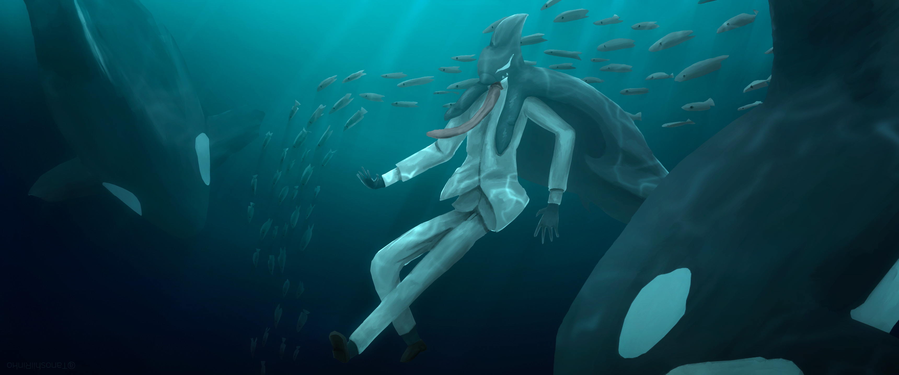

# Pushing The Boundaries 🍎🎹🎨🦈📑 ;

<h1></h1>

<table table align="center" border="0px">
<tr>
    <td text align="right" width=100%>
        <a href = "https://github.com/Appeleus">
            
            GITHUB &nbsp;
        </a>
    </td>
    <td text align="left">
        <a href = "https://www.canva.com/design/DAFm702Hvfs/HrEZAMiVxlJGzSejySWYbQ/edit?utm_content=DAFm702Hvfs&utm_campaign=designshare&utm_medium=link2&utm_source=sharebutton">
            
            &nbsp;PORTFOLIO
        </a>
    </td>
</tr>

<tr>
    <td text align="right">
        <a href = "https://twitter.com/TanoshiiRinko">
            
            TWITTER&nbsp;
        </a>
    </td>
    <td text align="left">
        <a href = "https://www.youtube.com/@TanoshiiRinko/featured">
            
            &nbsp;YOUTUBE
        </a>
    </td>
</tr>
</table>

<h1></h1>

